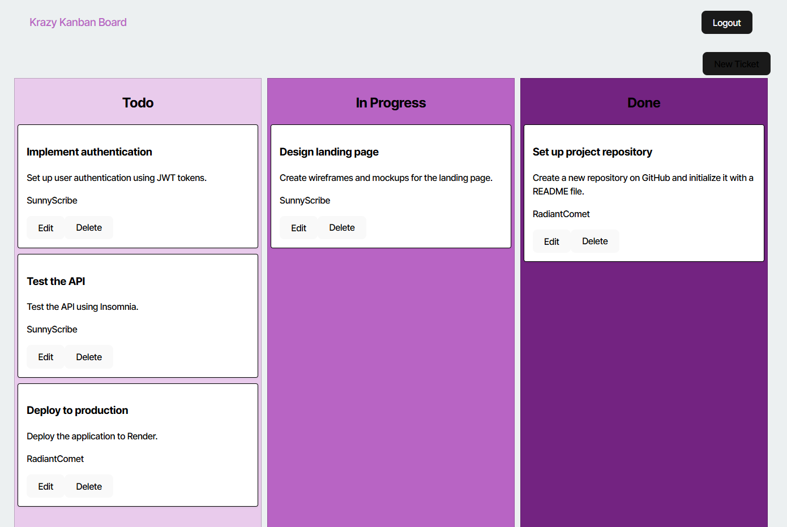

# Kanban Challenge

## Description

Krazy Kanban Board is a secure private Kanban Board full-stack web application to help organize and plan your next project!

## Table of Contents

* [Installation](#Installation)
* [Usage](#Usage)
* [License](#License)
* [Contributing](#Contributing)
* [Tests](#Tests)
* [Questions](#Questions)
 

## Installation

Here's a link to the [Deployed App](https://kanban-challenge.onrender.com/), no installation required.  

To install locally:  This app requires [Node.js](https://nodejs.org/en/download/prebuilt-installer) and [postgreSQL](https://www.postgresql.org/download/).  From the root directory, run `npm i` to install dependencies.  Then run `npm run build` to compile typescript and create server and client dist folders.  Then open postgreSQL from the commandline with `psql -U postgres`, enter your password and run `\i server/db/schema.sql` to create database. `\q` to quit postgreSQL. Run `mv server/.env.EXAMPLE server/.env`, then open the .env file and fill in the environment variables (the JWT can be anything).

## Usage

Here's a link to the [Deployed App](https://kanban-challenge.onrender.com/)

To use locally:  from the root directory, run `npm run start` to seed example data and serve on localhost:3001.  Use login "JollyGuru" and password "password" to log in. Navigate the UI to create new tickets, edit them, and delete them.

## License

  [MIT](https://opensource.org/licenses/MIT)

## Contributing

If you wish to contribute, please follow these [guidelines](https://www.contributor-covenant.org/version/2/1/code_of_conduct/).

## Tests

Locally:  To work in a developement environment using nodemon, run `npm run start:dev`.  The page will refresh when changes are made.

## Questions

If you have questions you can reach me at me@joshhensley.com. Add me on [Github](github.com/josh-hensley).
